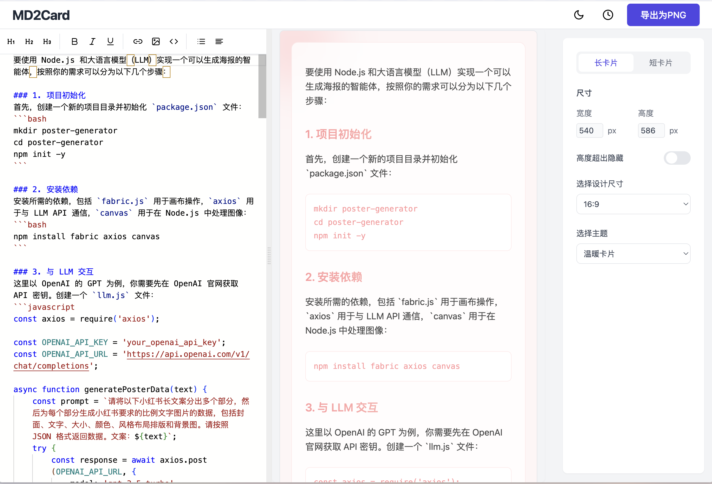

# MD2Card

MD2Card 是一个 Markdown 转卡片图片的工作台应用，当前已迁移到 Next.js App Router。

## 功能特性

- 实时编辑 Markdown 并即时预览
- 内置多套卡片主题
- 支持长卡片和分页卡片两种视图
- 自动保存编辑内容和界面设置
- 浏览器端一键导出 PNG
- 支持浏览器自动化导出校验

## 技术栈

- Next.js 16.2.1
- React 19.2.4
- TypeScript
- Tailwind CSS
- Monaco Editor
- Marked
- Zustand
- Styled Components

## 安装与运行

```bash
pnpm install
pnpm dev
```

## 构建

```bash
pnpm build
pnpm start
```

## 导出校验

```bash
pnpm verify:export -- --markdown /absolute/path/to/demo.md
```

常用参数：

- `--url http://127.0.0.1:3000/`
- `--output-dir ./tmp-downloads/export-verify`
- `--theme 社交图文`
- `--preset xiaohongshu`
- `--width 440 --height 587`
- `--profile-name 青玉白露`
- `--profile-time 03/30`
- `--profile-avatar /social-avatar.svg`

脚本会自动：

- 打开页面并注入 Markdown 与设置
- 导出 PNG 或 ZIP
- 对导出图片执行 OCR
- 对比预览文本与 OCR 文本
- 生成 `report.json`、截图和导出文件

## 预览


