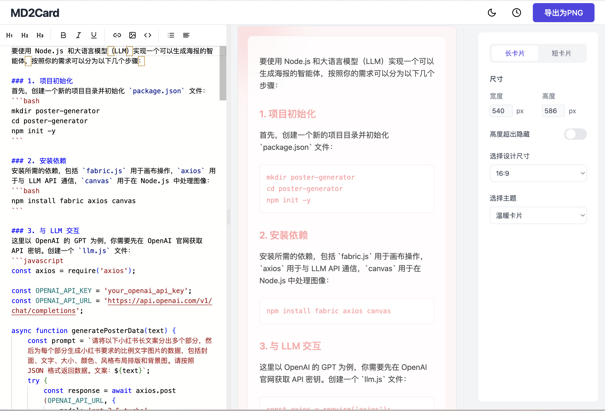

# ideaCard

ideaCard 是一个面向内容创作者的 Markdown 卡片生成器。它把一段 Markdown、公众号草稿、社交平台笔记或临时想法，快速排成适合分享的图片卡片。

在线体验：https://ideacard.aistar.cool

GitHub：https://github.com/white0dew/ideacard



## 特性

- Markdown 实时编辑、实时预览。
- 支持社交图文、留白文志、终端纪要等卡片主题。
- 支持小红书等常见图片比例，并按分页卡片导出。
- 支持本地图片粘贴、上传和浏览器本地缓存。
- 支持头像、昵称、日期、字体、颜色、字号、行距等社交图文配置。
- 支持一键导出 PNG；多页内容会自动打包为 ZIP。
- 支持复制纯文本，方便在多平台发布时复用正文。
- 编辑内容和界面设置会自动保存到浏览器本地。

## 作者

ideaCard 由青玉白露（white0dew）维护。

- GitHub：https://github.com/white0dew
- 个人站点：https://aistar.cool
- 博客：https://blog.aistar.cool

这个项目来自日常内容生产中的真实需求：把 AI、写作、产品记录和社交平台笔记更快地转成可发布的图片。

## 赞助与支持

如果 ideaCard 对你有帮助，可以通过青玉白露的中转赞助渠道支持后续维护。赞助会用于域名、服务器、图片存储、浏览器自动化校验和后续主题开发。

也欢迎通过 GitHub Star、Issue、Pull Request 或使用反馈来支持项目。

## 技术栈

- Next.js 16
- React 19
- TypeScript
- Tailwind CSS
- Monaco Editor
- Marked
- Zustand
- styled-components
- html-to-image

## 本地开发

```bash
pnpm install
pnpm dev
```

默认访问：

```text
http://localhost:3000
```

## 构建

```bash
pnpm build
pnpm start
```

## 测试

```bash
pnpm test
pnpm lint
pnpm build
```

## 导出校验

仓库内置了浏览器导出校验脚本，用来确认预览内容和实际导出的 PNG / ZIP 一致。

```bash
pnpm verify:export -- --markdown /absolute/path/to/demo.md
```

常用参数：

- `--url http://127.0.0.1:3000/`
- `--output-dir ./tmp-downloads/export-verify`
- `--theme 社交图文`
- `--preset xiaohongshu`
- `--width 440 --height 587`
- `--profile-name 青玉白露`
- `--profile-time 03/30`
- `--profile-avatar /social-avatar.svg`

脚本会自动打开页面、注入 Markdown 和设置、触发导出、执行 OCR 对照，并生成 `report.json`、截图和导出文件。

## 无头 CLI

将 Markdown、主题、画布与素材配置保存为一个 JSON 文件后，可以无需编辑器直接生成图片：

```bash
pnpm run ideacard validate --input ./card.json
pnpm run ideacard render --input ./card.json --out ./artifacts/card
```

不传输入参数时，CLI 默认读取 `.agents/skills/ideacard/default-input.json`；也支持 `--stdin`，但 `--input` 与 `--stdin` 只能二选一。图片素材需在 JSON 的 `assets` 中提供 Base64 数据，并在 Markdown 中使用 `asset://<id>` 引用。

编辑器底部的“复制 Agent 配置”只复制当前主题、画布、排版和头像来源，不复制文章 Markdown。持久默认值保存在 `.agents/skills/ideacard/visual-config.json`；把复制结果更新到该文件后，agent 会将其与待生成的 Markdown 合并，并将头像或正文图片整理为 CLI 所需的 `assets` 和 `asset://` 引用。

## 开源协议

MIT License
